# Model Domain & ERD

- **Issue:** #2 — [T0.2] Model domain & ERD
- **Status:** Draf untuk ditinjau
- **Tanggal:** 2026-09-17
- **Dasar:** UI di `frontend/` (tipe, data contoh, 16 layar admin, halaman publik)
  dan [ADR-0001](adr/0001-arsitektur-backend.md). Bila dokumen ini dan ADR
  berbeda, ADR yang berlaku.

## 1. Ringkasan

Model ini adalah rancangan skema Prisma + PostgreSQL untuk situs publik dan admin
CMS. Nama entitas dan field memakai camelCase Inggris agar bisa langsung dipakai
di `schema.prisma`. Nilai enum memakai kode yang stabil (ADR K2), sedangkan label
Indonesia/Inggris di UI dipetakan di frontend.

Keputusan inti:

| # | Keputusan |
| --- | --- |
| D1 | **ID** `String @id @default(uuid()) @db.Uuid`; semua waktu `DateTime @db.Timestamptz` (UTC). Setiap entitas utama punya `createdAt` dan `updatedAt`. |
| D2 | **Status terbit dan status stok produk dipisah**: `publishStatus` (DRAFT/PUBLISHED) dan `stockStatus` (IN_STOCK/LOW_STOCK/MADE_TO_ORDER). Di frontend lama, `"Draft"` masih menjadi salah satu nilai stok. |
| D3 | **Soft delete (Trash)** lewat `deletedAt` pada `Product`, `Article`, `Page`, dan `Media`. Isi Trash bisa dipulihkan selama 30 hari lalu dihapus permanen oleh job. `Artisan` tidak masuk Trash; datanya diarsipkan (`archivedAt`) karena menyimpan dokumen dan riwayat. |
| D4 | **Kategori produk** memakai tabel hierarkis (`Category.parentId`), menggantikan union hardcoded. **Kategori artikel** memakai **enum** karena tidak ada layar untuk mengelolanya dan nilainya hanya empat (lihat Q4). |
| D5 | **Material** punya tabel sendiri (taksonomi yang bisa difilter di katalog, M:N dengan produk, dan satu material ditandai primer). **Tag** adalah label bebas yang dipakai bersama oleh produk dan artikel. |
| D6 | **Spesifikasi dan QC dicatat per produk**: field inti terstruktur di `Product`, baris tambahan di `ProductSpec`, dan empat titik QC di `ProductQcCheck`. Konstanta global `PRODUCT_SPEC`/`QC_POINTS` tidak dipakai lagi. |
| D7 | **Isi rich text dan blok disimpan sebagai JSON** (`Product.description`, `Article.content`) dan divalidasi skema Zod di `@ornament/shared`. Pilihan ini membuat urutan blok tersimpan atomik dalam satu dokumen. Media yang dirujuk di dalam blok aman dari referensi rusak karena `Media` memakai soft delete. |
| D8 | **Media punya `visibility`**. `PUBLIC` dilayani lewat domain publik R2 (ADR K3). `PRIVATE` (dokumen pengrajin, lampiran inquiry/balasan) disimpan di prefix/bucket privat dan hanya diakses lewat presigned GET dari admin. |
| D9 | **Data PRIVAT** (ditandai 🔒 di tabel) tidak boleh masuk DTO `/public/*`. |
| D10 | **Blok global** (mis. Footer) adalah `PageBlock` dengan `pageId = null` dan `visibility = GLOBAL`. Satu baris dipakai di semua halaman. |
| D11 | **Pengaturan situs** disimpan di satu baris bertipe (`SiteSetting`, id tetap `1`), bukan key-value. Alasannya agar tipe dan validasinya dijaga oleh Prisma dan Zod. |

## 2. ERD

Diagram hanya memuat PK, FK, dan beberapa field kunci. Daftar field lengkap ada di §3.

```mermaid
erDiagram
    User ||--o{ Session : has
    User ||--o{ Invite : "invites (invitedBy)"
    User ||--o{ Media : uploads
    User ||--o{ Article : authors
    User ||--o{ ProductRevision : edits
    User ||--o{ InquiryReply : writes
    User ||--o{ Comment : "replies as admin"
    User ||--o{ ActivityLog : acts

    Category ||--o{ Category : parent
    Category ||--o{ Product : classifies
    Category ||--o{ NavItem : "target"
    Category ||--o{ Inquiry : "requested"

    Artisan ||--o{ Product : makes
    Artisan ||--o{ ArtisanImage : gallery
    Artisan ||--o{ ArtisanDocument : "private docs"
    Media ||--o{ Artisan : "photo"

    Product ||--o{ ProductMaterial : ""
    Material ||--o{ ProductMaterial : ""
    Material ||--o{ Inquiry : "requested"
    Product ||--o{ ProductTag : ""
    Tag ||--o{ ProductTag : ""
    Product ||--o{ ProductImage : gallery
    Product ||--o{ ProductSpec : specs
    Product ||--|{ ProductQcCheck : "4 QC stages"
    Product ||--o{ ProductRevision : revisions
    Media ||--o{ Product : "primaryImage"
    Media ||--o{ ProductImage : ""
    Media ||--o{ ArtisanImage : ""
    Media ||--o{ ArtisanDocument : ""

    Article ||--o{ ArticleTag : ""
    Tag ||--o{ ArticleTag : ""
    Article ||--o{ Comment : has
    Comment ||--o{ Comment : "replies"
    Media ||--o{ Article : "featuredImage"

    Inquiry ||--o{ InquiryReply : replies
    Inquiry ||--o{ InquiryAttachment : attachments
    InquiryReply ||--o{ InquiryAttachment : attachments
    Media ||--o{ InquiryAttachment : ""

    Page ||--o{ PageBlock : blocks
    Media ||--o{ PageBlock : image
    Page ||--o{ NavItem : "target"
    Media ||--o{ SiteSetting : "logo / icon"

    User {
        uuid id PK
        string email UK
        enum role
        enum status
    }
    Session {
        uuid id PK
        uuid userId FK
        string tokenHash UK
    }
    Invite {
        uuid id PK
        uuid invitedById FK
        string tokenHash UK
    }
    Media {
        uuid id PK
        string key UK
        enum visibility
        uuid uploadedById FK
    }
    Category {
        uuid id PK
        uuid parentId FK
        string slug UK
    }
    Material {
        uuid id PK
        string slug UK
    }
    Tag {
        uuid id PK
        string slug UK
    }
    Artisan {
        uuid id PK
        string slug UK
        enum status
        uuid photoId FK
    }
    ArtisanImage {
        uuid artisanId FK
        uuid mediaId FK
        int position
    }
    ArtisanDocument {
        uuid id PK
        uuid artisanId FK
        uuid mediaId FK
        enum kind
    }
    Product {
        uuid id PK
        string slug UK
        string sku UK
        enum publishStatus
        enum stockStatus
        uuid categoryId FK
        uuid artisanId FK
        uuid primaryImageId FK
        datetime deletedAt
    }
    ProductMaterial {
        uuid productId PK
        uuid materialId PK
        bool isPrimary
    }
    ProductTag {
        uuid productId PK
        uuid tagId PK
    }
    ProductImage {
        uuid productId FK
        uuid mediaId FK
        int position
    }
    ProductSpec {
        uuid id PK
        uuid productId FK
        int position
    }
    ProductQcCheck {
        uuid id PK
        uuid productId FK
        enum stage
        enum status
    }
    ProductRevision {
        uuid id PK
        uuid productId FK
        int number
        uuid editedById FK
    }
    Article {
        uuid id PK
        string slug UK
        enum status
        datetime publishAt
        uuid authorId FK
        uuid featuredImageId FK
    }
    ArticleTag {
        uuid articleId PK
        uuid tagId PK
    }
    Comment {
        uuid id PK
        uuid articleId FK
        uuid parentId FK
        uuid authorUserId FK
        enum status
    }
    Inquiry {
        uuid id PK
        int number UK
        string reference UK
        enum status
        uuid categoryId FK
        uuid materialId FK
    }
    InquiryReply {
        uuid id PK
        uuid inquiryId FK
        uuid authorId FK
        enum status
    }
    InquiryAttachment {
        uuid id PK
        uuid inquiryId FK
        uuid replyId FK
        uuid mediaId FK
    }
    Page {
        uuid id PK
        string path UK
        enum status
    }
    PageBlock {
        uuid id PK
        uuid pageId FK
        enum visibility
        int position
        uuid imageId FK
    }
    NavItem {
        uuid id PK
        enum type
        uuid pageId FK
        uuid categoryId FK
        int position
    }
    SiteSetting {
        int id PK
        uuid logoId FK
        uuid iconId FK
    }
    ActivityLog {
        uuid id PK
        uuid actorId FK
        enum kind
        string entityType
    }
```



## 3. Entitas

Kolom **Wajib**: ✓ = NOT NULL. Kolom **Indeks**: `PK`, `UK` (unik), `IX` (indeks
biasa). 🔒 = PRIVAT, hanya untuk admin. `createdAt`/`updatedAt` tidak ditulis
ulang di setiap tabel kecuali ada catatan khusus.

### 3.1 Akses

#### User

| Field | Tipe | Wajib | Indeks | Catatan |
| --- | --- | --- | --- | --- |
| id | Uuid | ✓ | PK | |
| email | String (citext) | ✓ | UK | Wajib berakhiran `@ornament.id` (dicek di API). |
| name | String | ✓ | | |
| passwordHash | String | ✓ | | 🔒 argon2id. Tidak pernah masuk DTO. |
| role | `UserRole` | ✓ | IX | |
| status | `UserStatus` | ✓ | IX | Default `ACTIVE`. "Cabut akses" → `REVOKED` dan hapus semua sesi user. |
| avatarId | Uuid → Media | | | Opsional; UI saat ini hanya memakai inisial. |
| lastActiveAt | DateTime | | | Diperbarui bersamaan dengan `Session.lastSeenAt` (dibatasi, mis. maks 1×/menit). |
| revokedAt | DateTime | | | |

User **tidak pernah dihapus permanen** karena menjadi penulis artikel dan pelaku di log.
Kolom "Konten" di UI diturunkan saat query (jumlah artikel/produk/revisi).

#### Session 🔒

| Field | Tipe | Wajib | Indeks | Catatan |
| --- | --- | --- | --- | --- |
| id | Uuid | ✓ | PK | |
| userId | Uuid → User | ✓ | IX | Cascade |
| tokenHash | String | ✓ | UK | SHA-256 dari token cookie (ADR K7). |
| expiresAt | DateTime | ✓ | IX | 12 jam; 30 hari bila "Ingat saya". |
| absoluteExpiresAt | DateTime | ✓ | | Batas atas untuk sliding refresh. |
| lastSeenAt | DateTime | ✓ | | |
| userAgent | String | | | |
| ip | String | | | |

#### Invite 🔒

| Field | Tipe | Wajib | Indeks | Catatan |
| --- | --- | --- | --- | --- |
| id | Uuid | ✓ | PK | |
| email | String (citext) | ✓ | IX | `@ornament.id`. Hanya boleh ada satu undangan aktif per email (unik parsial `WHERE acceptedAt IS NULL AND revokedAt IS NULL`, lewat migrasi SQL). |
| role | `UserRole` | ✓ | | |
| tokenHash | String | ✓ | UK | |
| expiresAt | DateTime | ✓ | | 72 jam (ADR K7). |
| invitedById | Uuid → User | ✓ | | Restrict |
| acceptedAt | DateTime | | | Saat diterima, `User` dibuat dalam transaksi yang sama. |
| revokedAt | DateTime | | | |
| emailMessageId / emailError | String | | | Hasil kirim Resend (ADR K4). |

Undangan yang tertunda tampil di tabel Users sebagai baris "Belum masuk".

### 3.2 Media

#### Media

| Field | Tipe | Wajib | Indeks | Catatan |
| --- | --- | --- | --- | --- |
| id | Uuid | ✓ | PK | |
| key | String | ✓ | UK | Key R2 `media/<yyyy>/<mm>/<id>-<slug>.<ext>`. File privat memakai prefix `private/`. |
| visibility | `MediaVisibility` | ✓ | IX | Default `PUBLIC`. |
| kind | `MediaKind` | ✓ | IX | Diturunkan dari MIME. Dipakai untuk filter "Gambar / Dokumen". |
| fileName | String | ✓ | | Nama file asli. |
| mimeType | String | ✓ | | Harus lolos allowlist. |
| sizeBytes | BigInt | ✓ | | Total terpakai = `SUM(sizeBytes)`. |
| width / height | Int | | | Hanya untuk gambar. |
| alt | String | | | Wajib diisi sebelum dipakai pada konten publik (validasi di API). |
| uploadedById | Uuid → User | | IX | SetNull. Null bila diunggah pengunjung (lampiran inquiry). |
| createdAt | DateTime | ✓ | IX | Untuk filter bulan. |
| deletedAt | DateTime | | IX | Trash |

Media dipakai oleh: `Product.primaryImageId`, `ProductImage`, `Artisan.photoId`,
`ArtisanImage`, `ArtisanDocument`, `Article.featuredImageId`, blok gambar di
`Article.content`, `PageBlock.imageId`, `SiteSetting.logoId/iconId`, dan
`InquiryAttachment`.

### 3.3 Taksonomi

#### Category

| Field | Tipe | Wajib | Indeks | Catatan |
| --- | --- | --- | --- | --- |
| id | Uuid | ✓ | PK | |
| name | String | ✓ | | |
| slug | String | ✓ | UK | Dibuat dari `name`; lihat §6.1. |
| parentId | Uuid → Category | | IX | Restrict: kategori yang masih punya anak tidak bisa dihapus. |
| description | String | | | |
| position | Int | ✓ | | Default 0. Menentukan urutan dalam satu induk. |

Kolom "Produk" di UI adalah jumlah produk yang diturunkan (bukan disimpan) dari
kategori itu beserta turunannya.

#### Material

| Field | Tipe | Wajib | Indeks | Catatan |
| --- | --- | --- | --- | --- |
| id | Uuid | ✓ | PK | |
| name | String | ✓ | UK | Contoh: "Rotan alami", "Jati reclaimed". |
| slug | String | ✓ | UK | |
| skuCode | String(3) | | UK | Kode SKU, mis. `RTN`, `TEK`, `WHY` (§6.2). |

Hitungan dan ukuran tag di layar taksonomi diturunkan dari `ProductMaterial`.

#### Tag

| Field | Tipe | Wajib | Indeks | Catatan |
| --- | --- | --- | --- | --- |
| id | Uuid | ✓ | PK | |
| name | String | ✓ | | Contoh: "handwoven", "bantul". |
| slug | String | ✓ | UK | Dinormalisasi huruf kecil; tag yang sama dipakai ulang, tidak diduplikasi. |

### 3.4 Pengrajin

#### Artisan

| Field | Tipe | Wajib | Indeks | Catatan |
| --- | --- | --- | --- | --- |
| id | Uuid | ✓ | PK | |
| name | String | ✓ | | Nama workshop. |
| slug | String | ✓ | UK | `/pengrajin/<slug>` |
| contactName | String | | | 🔒 Nama penanggung jawab. |
| phone | String | | | 🔒 Format E.164. |
| partnerSinceYear | Int | | | Ditampilkan sebagai "Mitra sejak 2018". |
| village | String | | | Desa/kelurahan, mis. "Bangunjiwo". |
| regency | String | ✓ | IX | Kabupaten, mis. "Bantul". Dipakai filter "daerah" di tabel produk. |
| province | String | ✓ | | |
| address | String | | | 🔒 Alamat lengkap. |
| craftsmenCount | Int | | | "8 penganyam" |
| monthlyCapacity | Int | | | |
| capacityUnit | String | ✓ | | Default `pcs`. |
| avgLeadTimeDays | Int | | | |
| skills | String[] | ✓ | | Keahlian. Elemen pertama ditampilkan sebagai keahlian utama. |
| summary | String | | | Ringkasan untuk kartu/daftar (dulu `note`). **Publik.** |
| story | Json | | | Profil publik (rich text) di halaman pengrajin. |
| internalNotes | String | | | 🔒 Kekuatan, keterbatasan, catatan negosiasi. |
| status | `ArtisanStatus` | ✓ | IX | Default `VERIFICATION`. |
| photoId | Uuid → Media | | | Foto workshop utama. SetNull. |
| archivedAt | DateTime | | IX | "Arsipkan" |

#### ArtisanImage

`artisanId` (Cascade), `mediaId` (Restrict), `position` Int, `caption` String?.
PK komposit (`artisanId`, `mediaId`). Galeri publik seperti "Proses anyam" dan "Detail material".

#### ArtisanDocument 🔒

| Field | Tipe | Wajib | Indeks | Catatan |
| --- | --- | --- | --- | --- |
| id | Uuid | ✓ | PK | |
| artisanId | Uuid → Artisan | ✓ | IX | Cascade |
| mediaId | Uuid → Media | ✓ | | Restrict; Media harus `PRIVATE`. |
| kind | `ArtisanDocumentKind` | ✓ | | |
| title | String | ✓ | | |
| uploadedById | Uuid → User | | | SetNull |

### 3.5 Produk

#### Product

| Field | Tipe | Wajib | Indeks | Catatan |
| --- | --- | --- | --- | --- |
| id | Uuid | ✓ | PK | |
| name | String | ✓ | | |
| slug | String | ✓ | UK | `/produk/<slug>` |
| sku | String | ✓ | UK | §6.2 |
| description | Json | | | Rich text: tebal/miring/garis bawah/daftar/tautan/gambar. |
| excerpt | String | | | Teks singkat untuk kartu dan meta description; bila kosong, dibuat dari `description`. |
| categoryId | Uuid → Category | ✓ | IX | Restrict |
| artisanId | Uuid → Artisan | | IX | Restrict. Boleh null saat draf, **wajib saat publish**. |
| moqQuantity | Int | ✓ | | |
| moqUnit | String | ✓ | | `pcs` / `set` / `panel`. Juga menjadi satuan stok. |
| leadTimeDays | Int | | | |
| lengthCm / widthCm / heightCm | Decimal(7,1) | | | Ditampilkan "45 × 45 × 38 cm". |
| weightKg | Decimal(7,2) | | | Berat per pcs. |
| fobPriceUsd | Decimal(10,2) | | | Harga FOB per unit. 🔒 hingga Q7 diputuskan. |
| fobPort | String | | | Default "Semarang". |
| stockStatus | `StockStatus` | ✓ | IX | |
| stockQuantity | Int | | | Null bila `MADE_TO_ORDER`. |
| stockNote | String | | | 🔒 Catatan internal, mis. "Menunggu foto produk". |
| publishStatus | `PublishStatus` | ✓ | IX | Default `DRAFT`. |
| publishedAt | DateTime | | IX | Diisi saat pertama kali publish. |
| primaryImageId | Uuid → Media | | | SetNull. Wajib saat publish. |
| revision | Int | ✓ | | Default 1. §6.3 |
| duplicatedFromId | Uuid → Product | | | SetNull. Jejak asal duplikat. |
| createdById / updatedById | Uuid → User | | | SetNull |
| deletedAt | DateTime | | IX | Trash (§6.4) |

Indeks komposit `(publishStatus, deletedAt, categoryId)` untuk katalog publik.
`origin` pada tipe lama diturunkan dari `artisan.village/regency`.

#### ProductMaterial

`productId` (Cascade) + `materialId` (Restrict) sebagai PK komposit, ditambah
`isPrimary` Boolean. Tepat satu baris `isPrimary = true` per produk (unik parsial
`(productId) WHERE isPrimary`). Material primer ditampilkan di kolom "Material"
dan dipakai sebagai kode SKU.

#### ProductTag

`productId` (Cascade) + `tagId` (Cascade). PK komposit.

#### ProductImage

`productId` (Cascade), `mediaId` (Restrict), `position` Int. PK komposit
(`productId`, `mediaId`). Galeri **tidak** berisi foto utama.

#### ProductSpec

| Field | Tipe | Wajib | Indeks | Catatan |
| --- | --- | --- | --- | --- |
| id | Uuid | ✓ | PK | |
| productId | Uuid → Product | ✓ | IX | Cascade |
| label | String | ✓ | | Contoh: "Finishing", "Panjang kabel". |
| value | String | ✓ | | Contoh: "Natural clear coat". |
| position | Int | ✓ | | |

Tabel spesifikasi publik adalah gabungan field inti `Product` (Dimensi, Material,
MOQ, Lead time, Harga FOB <port>) dan baris `ProductSpec`, sesuai urutannya.

#### ProductQcCheck

| Field | Tipe | Wajib | Indeks | Catatan |
| --- | --- | --- | --- | --- |
| id | Uuid | ✓ | PK | |
| productId | Uuid → Product | ✓ | UK(productId, stage) | Cascade |
| stage | `QcStage` | ✓ | | |
| status | `QcStatus` | ✓ | | Default `PENDING`. |
| criteria | String | | | Kriteria lulus yang ditampilkan publik, mis. "Diameter dan kadar air rotan dicatat…". |
| notes | String | | | 🔒 |
| checkedById | Uuid → User | | | SetNull |
| checkedAt | DateTime | | | |

Empat baris (satu per `stage`) dibuat bersamaan dengan produk. Ini adalah
checklist **per produk**. QC per batch produksi ("Frame check lolos untuk batch
…") ikut Order produksi yang masih ditunda.

#### ProductRevision 🔒

| Field | Tipe | Wajib | Indeks | Catatan |
| --- | --- | --- | --- | --- |
| id | Uuid | ✓ | PK | |
| productId | Uuid → Product | ✓ | UK(productId, number) | Cascade |
| number | Int | ✓ | | |
| snapshot | Json | ✓ | | Isi produk beserta relasinya pada revisi ini. |
| editedById | Uuid → User | | | SetNull |
| createdAt | DateTime | ✓ | | |

### 3.6 Artikel & komentar

#### Article

| Field | Tipe | Wajib | Indeks | Catatan |
| --- | --- | --- | --- | --- |
| id | Uuid | ✓ | PK | |
| title | String | ✓ | | |
| slug | String | ✓ | UK | `/journal/<slug>` |
| excerpt | String | | | Bila kosong, dibuat dari paragraf pertama (maks 200 karakter). |
| content | Json | ✓ | | Array blok, lihat format di bawah. |
| category | `ArticleCategory` | ✓ | IX | |
| authorId | Uuid → User | ✓ | IX | Restrict |
| featuredImageId | Uuid → Media | | | SetNull |
| status | `ArticleStatus` | ✓ | IX | Default `DRAFT`. |
| publishAt | DateTime | | IX | Wajib bila `SCHEDULED`. |
| publishedAt | DateTime | | IX | Tanggal yang ditampilkan publik (menggantikan `date`). |
| wordCount | Int | ✓ | | Diturunkan saat simpan; ditampilkan "Kata: 612". |
| deletedAt | DateTime | | IX | Trash |

Format `content` (Zod di `@ornament/shared`):

```ts
type ArticleBlock =
  | { id: string; type: "paragraph"; text: RichInline[] }
  | { id: string; type: "heading2"; text: string }
  | { id: string; type: "quote"; text: string; cite?: string }
  | { id: string; type: "image"; mediaId: string; caption?: string };
// RichInline = teks dengan mark bold/italic/link(href)
```

#### ArticleTag

`articleId` (Cascade) + `tagId` (Cascade). PK komposit.

#### Comment

| Field | Tipe | Wajib | Indeks | Catatan |
| --- | --- | --- | --- | --- |
| id | Uuid | ✓ | PK | |
| articleId | Uuid → Article | ✓ | IX(articleId, status, createdAt) | Cascade (hanya berlaku saat artikel dihapus permanen). |
| parentId | Uuid → Comment | | IX | Cascade. Dipakai untuk "Balas" dari admin; nesting maksimal 1 tingkat. |
| authorName | String | ✓ | | |
| authorEmail | String | | | 🔒 Tidak pernah tampil publik. Lihat Q9. |
| authorUserId | Uuid → User | | | SetNull. Terisi bila yang menulis admin (balasan). |
| body | String | ✓ | | Teks polos, maks 2000 karakter. |
| status | `CommentStatus` | ✓ | IX | Default `PENDING`. Balasan admin langsung `APPROVED`. |
| moderatedById | Uuid → User | | | SetNull |
| moderatedAt | DateTime | | | |
| ipHash | String | | | 🔒 Untuk rate limit/anti-spam, bukan IP mentah. |
| userAgent | String | | | 🔒 |

### 3.7 Inquiry

#### Inquiry

| Field | Tipe | Wajib | Indeks | Catatan |
| --- | --- | --- | --- | --- |
| id | Uuid | ✓ | PK | |
| number | Int | ✓ | UK | `@default(autoincrement())` |
| reference | String | ✓ | UK | `INQ-0001` (§6.5) |
| subject | String | ✓ | | Dihasilkan otomatis (§6.5). |
| name | String | ✓ | | |
| company | String | | | |
| email | String | ✓ | IX | 🔒 |
| country | String | | | Negara tujuan. Teks bebas sekarang; ISO-3166 sebagai opsi nanti. |
| categoryId | Uuid → Category | | | SetNull. Null = "Belum menentukan". |
| categoryLabel | String | | | Snapshot nama kategori saat submit. |
| materialId | Uuid → Material | | | SetNull. Null = "Terbuka untuk saran". |
| materialLabel | String | | | Snapshot nama material. |
| volumeQuantity | Int | ✓ | | Form: "Volume (pcs)". |
| targetShipment | String | | | Teks bebas ("Nov 2026"). Lihat Q10. |
| destinationPort | String | | | |
| budgetPerUnitUsd | Decimal(10,2) | | | Opsional |
| message | String | | | "Detail proyek". Preview di daftar diturunkan (±120 karakter). |
| status | `InquiryStatus` | ✓ | IX(status, createdAt) | Default `NEW`. |
| readAt | DateTime | | | |
| completedAt | DateTime | | | |
| ipHash / userAgent | String | | | 🔒 Anti-spam |
| notificationMessageId / notificationError | String | | | Hasil kirim email notifikasi ke tim. |

Semua isi inquiry 🔒 dan tidak pernah diekspos ke publik. Respons submit publik
hanya mengembalikan `reference`.

#### InquiryReply 🔒

| Field | Tipe | Wajib | Indeks | Catatan |
| --- | --- | --- | --- | --- |
| id | Uuid | ✓ | PK | |
| inquiryId | Uuid → Inquiry | ✓ | IX | Cascade |
| authorId | Uuid → User | ✓ | | Restrict |
| toEmail | String | ✓ | | Diambil dari `Inquiry.email` saat dikirim. |
| subject | String | ✓ | | Default `Re: <Inquiry.subject>`. |
| body | String | ✓ | | |
| status | `ReplyStatus` | ✓ | IX | `DRAFT` → `SENT`/`FAILED` |
| sentAt | DateTime | | | |
| emailMessageId / emailError | String | | | Resend (ADR K4) |

#### InquiryAttachment 🔒

| Field | Tipe | Wajib | Indeks | Catatan |
| --- | --- | --- | --- | --- |
| id | Uuid | ✓ | PK | |
| inquiryId | Uuid → Inquiry | ✓ | IX | Cascade |
| replyId | Uuid → InquiryReply | | IX | Cascade. **Null** = lampiran dari pembeli (gambar teknis/referensi); terisi = lampiran penawaran pada balasan. |
| mediaId | Uuid → Media | ✓ | | Restrict. `PRIVATE`; PDF/JPG/PNG, maks 10 MB. |

### 3.8 Situs: halaman, navigasi, pengaturan, log

#### Page

| Field | Tipe | Wajib | Indeks | Catatan |
| --- | --- | --- | --- | --- |
| id | Uuid | ✓ | PK | |
| title | String | ✓ | | "Beranda (Landing Page)" |
| path | String | ✓ | UK | `/`, `/our-story`, `/catalog`, `/terms`, `/kontak` |
| systemKey | String | | UK | `home`, `catalog`, `contact`, …: halaman yang punya route kode. Tidak bisa masuk Trash. |
| status | `PublishStatus` | ✓ | IX | |
| metaTitle / metaDescription | String | | | Opsional; bila kosong memakai `SiteSetting`. |
| updatedById | Uuid → User | | | SetNull |
| deletedAt | DateTime | | IX | Trash |

Kolom "Blok" diturunkan dari jumlah `PageBlock`. Kolom "Diperbarui" adalah
`updatedAt` (juga disentuh saat bloknya berubah).

#### PageBlock

| Field | Tipe | Wajib | Indeks | Catatan |
| --- | --- | --- | --- | --- |
| id | Uuid | ✓ | PK | |
| pageId | Uuid → Page | | IX(pageId, position) | Cascade. **Null ⇔ `visibility = GLOBAL`** (CHECK constraint). |
| type | `BlockType` | ✓ | | Tetap; admin tidak membuat tipe baru (ADR K11). |
| name | String | ✓ | | Label di builder, mis. "Hero — Good Value". |
| visibility | `BlockVisibility` | ✓ | | |
| position | Int | ✓ | | Urutan dalam halaman. Blok global dirender di akhir, diurutkan dengan field ini. |
| layout | `BlockLayout` | ✓ | | Default `LEFT`. |
| title | String | | | |
| body | String | | | |
| cta1Label / cta1Url | String | | | |
| cta2Label / cta2Url | String | | | |
| imageId | Uuid → Media | | | SetNull |
| config | Json | | | Opsi khusus tipe, mis. `{ productCount: 6 }` untuk PRODUCT_PREVIEW. |

URL CTA boleh berupa path internal (`/kontak`) atau `https://…`. Selain itu ditolak.

#### NavItem

| Field | Tipe | Wajib | Indeks | Catatan |
| --- | --- | --- | --- | --- |
| id | Uuid | ✓ | PK | |
| label | String | ✓ | | |
| type | `NavItemType` | ✓ | | |
| pageId | Uuid → Page | | | Cascade. Wajib bila `PAGE`. |
| categoryId | Uuid → Category | | | Cascade. Wajib bila `CATEGORY`. |
| url | String | | | Wajib bila `CUSTOM_LINK`. Untuk tipe lain diturunkan. |
| style | `NavItemStyle` | ✓ | | `BUTTON` untuk "Consult Your Project". |
| position | Int | ✓ | IX | |

Menu hanya satu tingkat, sesuai UI.

#### SiteSetting (singleton)

| Field | Tipe | Wajib | Catatan |
| --- | --- | --- | --- |
| id | Int | ✓ | PK, selalu `1` (CHECK). |
| siteName | String | ✓ | |
| tagline | String | | |
| contactEmail | String | ✓ | Menggantikan `NEXT_PUBLIC_CONTACT_EMAIL`. |
| instagramHandle / instagramUrl | String | | |
| siteLanguage | `SiteLanguage` | ✓ | |
| timezone | String | ✓ | IANA, default `Asia/Jakarta`. |
| address | String | | Alamat workshop (publik). |
| logoId / iconId | Uuid → Media | | SetNull |
| seoHomeTitle | String | | |
| seoKeywords | String | | |
| seoDescription | String(160) | | |
| sitemapEnabled | Boolean | ✓ | Default `true`. |
| allowIndexing | Boolean | ✓ | Default `true`. `false` = noindex. |
| updatedById | Uuid → User | | SetNull |

#### ActivityLog

| Field | Tipe | Wajib | Indeks | Catatan |
| --- | --- | --- | --- | --- |
| id | Uuid | ✓ | PK | |
| kind | `ActivityKind` | ✓ | IX | Label feed: Produk, QC, Inquiry, … |
| action | String | ✓ | | Kode, mis. `product.published`, `inquiry.created`. |
| message | String | ✓ | | Teks siap tampil, dibuat saat kejadian. |
| actorId | Uuid → User | | IX | SetNull. Null = "Sistem" (submit publik, job). |
| entityType | String | | IX(entityType, entityId) | `Product`, `Inquiry`, … (polimorfik, tanpa FK). |
| entityId | Uuid | | | |
| metadata | Json | | | |
| createdAt | DateTime | ✓ | IX | |

Hanya bisa ditambah (append-only). Retensi di Q12.

## 4. Enum

| Enum | Nilai (kode → label UI) |
| --- | --- |
| UserRole | `ADMINISTRATOR` Administrator · `EDITOR` Editor · `CONTRIBUTOR` Contributor |
| UserStatus | `ACTIVE` · `REVOKED` |
| MediaVisibility | `PUBLIC` · `PRIVATE` |
| MediaKind | `IMAGE` Gambar · `DOCUMENT` Dokumen |
| PublishStatus | `DRAFT` Draft · `PUBLISHED` Published (Product, Page) |
| StockStatus | `IN_STOCK` In Stock · `LOW_STOCK` Low Stock · `MADE_TO_ORDER` Made to Order |
| QcStage | `MATERIAL` · `FRAME` · `FINISHING` · `PACKAGING` |
| QcStatus | `PENDING` (belum) · `IN_PROGRESS` proses · `PASSED` ✓ · `FAILED` |
| ArtisanStatus | `VERIFICATION` Verifikasi · `ACTIVE` Aktif · `FULL_CAPACITY` Kapasitas penuh |
| ArtisanDocumentKind | `PARTNERSHIP_AGREEMENT` Perjanjian kerja sama · `MATERIAL_ORIGIN` Catatan asal material · `OTHER` |
| ArticleCategory | `CRAFT_JOURNAL` Craft Journal · `PROCESS` Process · `MATERIAL` Material · `ARTISAN_STORY` Artisan Story |
| ArticleStatus | `DRAFT` · `SCHEDULED` · `PUBLISHED` |
| CommentStatus | `PENDING` Menunggu · `APPROVED` Disetujui · `SPAM` Spam · `DELETED` Terhapus |
| InquiryStatus | `NEW` Baru (tab "Belum dibaca") · `IN_PROGRESS` Diproses ("Ditindaklanjuti") · `DONE` Selesai |
| ReplyStatus | `DRAFT` · `SENT` · `FAILED` |
| BlockType | `HERO` · `STORY` · `PRODUCT_PREVIEW` · `PROCESS` · `TERMS` · `FOOTER` · `TESTIMONIAL` · `RICH_TEXT` |
| BlockVisibility | `ACTIVE` Aktif · `GLOBAL` Global · `HIDDEN` Tersembunyi |
| BlockLayout | `LEFT` Kiri · `CENTER` Tengah · `BLEED` Bleed |
| NavItemType | `PAGE` Halaman · `CATEGORY` Kategori · `ARTICLE_ARCHIVE` Arsip · `CUSTOM_LINK` Tautan khusus |
| NavItemStyle | `LINK` · `BUTTON` Tombol |
| SiteLanguage | `ID` Bahasa Indonesia · `EN` English · `BILINGUAL` Dwibahasa |
| ActivityKind | `PRODUCT` · `QC` · `INQUIRY` · `ARTICLE` · `ARTISAN` · `COMMENT` · `PAGE` · `MEDIA` · `USER` · `SETTING` |

## 5. Relasi & aturan hapus

| Relasi | onDelete | Alasan |
| --- | --- | --- |
| Session/Invite → User | Cascade / Restrict | Sesi ikut user. User tidak dihapus (status `REVOKED`). |
| Category → Category (parent) | Restrict | Pindahkan atau hapus anak lebih dulu. |
| Product → Category | Restrict | Kategori yang masih punya produk (termasuk di Trash) tidak bisa dihapus. Lihat Q5. |
| Product → Artisan | Restrict | Pengrajin diarsipkan, tidak dihapus. |
| ProductMaterial → Material | Restrict | Material yang masih dipakai tidak bisa dihapus. |
| ProductTag/ArticleTag → Tag | Cascade | Menghapus tag cukup melepasnya dari konten. |
| ProductImage/Spec/QcCheck/Revision/Material/Tag → Product | Cascade | Hanya terpicu saat produk dihapus **permanen**. |
| *Image/*Document/InquiryAttachment → Media | Restrict | Media yang masih dipakai tidak bisa dihapus permanen. |
| Product.primaryImage, Article.featuredImage, Artisan.photo, PageBlock.image, SiteSetting.logo/icon → Media | SetNull | Hanya terpicu saat purge; API menolak memindahkan ke Trash media yang masih dipakai konten yang terbit. |
| Article → User (author) | Restrict | |
| Comment → Article | Cascade | Ikut purge artikel. |
| Comment → Comment (parent) | Cascade | |
| InquiryReply/InquiryAttachment → Inquiry | Cascade | Inquiry tidak dihapus lewat UI; Cascade hanya untuk pembersihan data (Q11). |
| Inquiry → Category/Material | SetNull | Snapshot label tetap ada. |
| PageBlock → Page | Cascade | |
| NavItem → Page/Category | Cascade | Item menu yang targetnya hilang ikut terhapus. |
| ActivityLog.actor, *.createdBy/updatedBy/checkedBy/moderatedBy | SetNull | |

**Soft delete:** `Product`, `Article`, `Page`, `Media` (`deletedAt`). `Artisan`
diarsipkan (`archivedAt`). `Comment` memakai status `DELETED`. `User` memakai status
`REVOKED`. Semua query publik dan query daftar admin default menyaring `deletedAt IS NULL`.

## 6. Aturan bisnis

### 6.1 Slug
- Dibuat server dari `name`/`title`: huruf kecil, `[^a-z0-9]+` → `-`, tanpa `-` di
  awal/akhir, maks 80 karakter. Frontend hanya menampilkan pratinjau.
- Unik per tabel (`Product`, `Article`, `Artisan`, `Category`, `Material`, `Tag`),
  **termasuk baris di Trash**, supaya pemulihan tidak pernah bentrok. Bila bentrok,
  tambahkan akhiran `-2`, `-3`, dan seterusnya.
- Slug tidak berubah otomatis setelah pertama kali terbit (URL publik stabil).
  Perubahan manual oleh Editor+ diizinkan (redirect 301 ada di Q8).

### 6.2 SKU
- Format `ORN-<skuCode material primer>-<NNNN>`, mis. `ORN-RTN-0142`. `NNNN` diambil
  dari sequence Postgres global, dengan padding minimal 4 digit.
- Dibuat server saat produk pertama kali disimpan. Nilai `ORN-NEW-xxxx` dari UI saat
  ini tidak dipakai. SKU **tidak berubah** walaupun material primer diganti (Q6).
- Unik termasuk baris di Trash, dan tidak pernah dipakai ulang.

### 6.3 Produk: publikasi, stok, revisi, duplikat
- **Syarat publish:** `name`, `categoryId`, `artisanId`, `primaryImageId`, material
  primer, `moqQuantity`, dan artisan tidak diarsipkan.
- Publik hanya menampilkan `publishStatus = PUBLISHED AND deletedAt IS NULL`.
  Produk dari artisan berstatus `VERIFICATION` tetap tampil bila sudah publish.
  Halaman artisan sendiri disembunyikan (§6.7).
- `stockStatus = MADE_TO_ORDER` ⇒ `stockQuantity = null`. Teks stok di tabel
  ("84 unit siap kirim", "Lead time 45 hari") diturunkan, bukan disimpan.
- **Revisi:** setiap simpan yang mengubah isi menjalankan `revision += 1` dan
  menulis `ProductRevision` (snapshot sesudah perubahan) dalam satu transaksi.
  Pemulihan ke revisi lama belum ada di UI.
- **Duplikat:** membuat produk baru dengan `name + " (copy)"`, slug unik baru
  (`<slug>-copy`, `-copy-2`, …), SKU baru dari sequence, `publishStatus = DRAFT`,
  `revision = 1`, dan `duplicatedFromId`. Yang ikut disalin: material, tag,
  spesifikasi, galeri (merujuk Media yang sama), foto utama, artisan, kategori,
  dan field inti. Checklist QC direset ke `PENDING` (Q6).
- **Aksi massal** yang baru: "Terbitkan", "Jadikan Draft", "Pindahkan ke Trash".
  Aksi lama "Tandai In Stock" dipecah menjadi aksi publikasi dan ubah stok
  terpisah (lihat §7).

### 6.4 Trash 30 hari
- Memindahkan ke Trash = mengisi `deletedAt = now()`. Pulihkan = `deletedAt = null`.
  Status publikasi **tidak diubah**, jadi produk yang terbit langsung tayang lagi
  setelah dipulihkan (Q3).
- Job harian menghapus permanen `Product`/`Article`/`Page` dengan
  `deletedAt < now() - 30 hari`. `Media` di-purge dengan batas yang sama **dan**
  hanya bila tidak lagi dirujuk; objek R2 dihapus setelah baris DB terhapus.
- Setelah purge, slug dan SKU tetap tidak dipakai ulang (SKU dari sequence, slug
  bebas dipakai lagi).
- Pemindahan ke Trash dan pemulihan dicatat di `ActivityLog`, lalu memicu
  revalidasi Next.

### 6.5 Inquiry
- `number` dari sequence. `reference = "INQ-" + lpad(number, 4, "0")` diisi dalam
  transaksi yang sama. Setelah 9999 panjangnya bertambah tanpa dipotong.
- `subject` dihasilkan saat submit dan tidak bisa diedit:
  `"<materialLabel ?? categoryLabel ?? 'Permintaan produk'> — <volumeQuantity> pcs"`,
  contoh "Rotan alami — 400 pcs". Bila kategori dan material sama-sama terisi:
  `"<categoryLabel> <materialLabel> — 400 pcs"`.
- Transisi status: `NEW → IN_PROGRESS` otomatis saat balasan pertama `SENT`.
  `NEW|IN_PROGRESS → DONE` lewat "Tandai selesai" (mengisi `completedAt`).
  `DONE → IN_PROGRESS` diizinkan bila ada balasan baru.
- Balasan: disimpan `DRAFT` lebih dulu, lalu dikirim via Resend **setelah commit**.
  Hasilnya `SENT` dengan `emailMessageId`, atau `FAILED` dengan `emailError`, dan bisa
  dikirim ulang. Balasan yang terkirim tidak bisa diedit.
- Submit publik: validasi `name`, `email`, dan `volumeQuantity > 0`, honeypot, rate
  limit per `ipHash`. Setelah itu buat `ActivityLog` (actor null) dan kirim email
  notifikasi ke `SiteSetting.contactEmail`.

### 6.6 Artikel: publikasi terjadwal (ADR K8)
- `SCHEDULED` membutuhkan `publishAt > now()` saat disimpan. `PUBLISHED` langsung
  mengisi `publishedAt = now()` bila kosong.
- Status dianggap terbit oleh query publik bila
  `status = PUBLISHED OR (status = SCHEDULED AND publishAt <= now())`, dan
  `deletedAt IS NULL`.
- Job 60 detik: `SCHEDULED → PUBLISHED`, `publishedAt = publishAt`, lalu revalidasi.
- Contributor hanya boleh menyimpan `DRAFT`. Menjadwalkan dan menerbitkan butuh
  Editor+ (juga berlaku untuk publish produk).

### 6.7 Pengrajin
- Artisan baru selalu `VERIFICATION`. Halaman publik `/pengrajin/<slug>` hanya untuk
  `ACTIVE`/`FULL_CAPACITY` dan `archivedAt IS NULL`.
- DTO publik **tidak** memuat `contactName`, `phone`, `address`, `internalNotes`,
  dokumen, ataupun Media `PRIVATE`.
- Statistik publik ("14 produk aktif") diturunkan dari produk yang terbit.
- Contributor hanya bisa melihat, tanpa field 🔒 (tabel hak akses: "Lihat").

### 6.8 Komentar
- Submit publik → `PENDING`. Hanya `APPROVED` yang tampil. Hitungan "Diskusi (n)" =
  jumlah komentar `APPROVED`.
- `DELETED` adalah soft delete (tidak tampil di tab mana pun). `SPAM` bisa dikembalikan
  ke `APPROVED`.
- Komentar pada artikel yang belum/tidak terbit ditolak.

### 6.9 Lain-lain
- Login: email `@ornament.id` **dan** `User.status = ACTIVE` (ADR K7).
- Page `systemKey` tidak bisa masuk Trash atau diubah `path`-nya.
- Menyimpan `SiteSetting`, `NavItem`, `Page`/`PageBlock` memicu revalidasi tag Next yang terkait.
- Setiap aksi admin yang tampil di feed menulis `ActivityLog` dalam transaksi yang sama.

## 7. Pemetaan dari tipe frontend lama

### Product (`frontend/lib/types.ts`)

| Lama | Baru | Perubahan |
| --- | --- | --- |
| `slug`, `name`, `sku` | sama | SKU dibuat server (§6.2). |
| `category: "Lighting" \| …` | `categoryId` → `Category` | Union hardcoded diganti tabel hierarkis. |
| `material: string` | `ProductMaterial[]` (+ `isPrimary`) → `Material` | Satu string diganti M:N. |
| `origin: string` | turunan `artisan.village`, `artisan.regency` | Dihapus dari produk. |
| `moq: "50 pcs"` | `moqQuantity` + `moqUnit` | Dipecah. |
| `status: StockStatus` (termasuk "Draft") | `publishStatus` + `stockStatus` | **Dipisah**; `"Draft"` pindah ke `publishStatus`. |
| `stock: "84 unit siap kirim"` | `stockQuantity` (+ `stockNote` 🔒) | Teks diturunkan. |
| — (form editor) | `description`, `leadTimeDays`, `lengthCm/widthCm/heightCm`, `weightKg`, `fobPriceUsd`, `fobPort` | **Ditambah** |
| — (form editor) | `primaryImageId`, `ProductImage[]`, `ProductTag[]`, `artisanId`, `revision`, `deletedAt`, `publishedAt`, `excerpt`, `duplicatedFromId` | **Ditambah** |
| `PRODUCT_SPEC` (global) | field inti + `ProductSpec[]` per produk | Dari global jadi per produk. |
| `QC_POINTS` (global) | `ProductQcCheck[]` (stage, status, criteria) per produk | Dari global jadi per produk, dengan status. |

Tab admin "Published/Draft" memakai `publishStatus`. Filter "daerah" memakai
`artisan.regency`. Aksi massal "Tandai In Stock" menjadi "Terbitkan".

### Artisan

| Lama | Baru | Perubahan |
| --- | --- | --- |
| `slug`, `name`, `status` | sama | Status jadi kode enum. |
| `initial` | — | Diturunkan dari `name` di frontend. |
| `craft` | `skills[0]` | Jadi array. |
| `place: "Bangunjiwo, Bantul"` | `village` + `regency` + `province` | Dipecah. |
| `since: "mitra sejak 2018"` | `partnerSinceYear: 2018` | Teks diganti Int. |
| `capacity: "600 pcs"` | `monthlyCapacity` + `capacityUnit` | Dipecah. |
| `note` | `summary` (publik) | Diganti nama. `internalNotes` 🔒 terpisah. |
| — | `contactName`🔒, `phone`🔒, `address`🔒, `craftsmenCount`, `avgLeadTimeDays`, `story`, `photoId`, `ArtisanImage[]`, `ArtisanDocument[]`🔒, `archivedAt` | **Ditambah** |

### Article

| Lama | Baru | Perubahan |
| --- | --- | --- |
| `slug`, `title`, `excerpt` | sama | |
| `category` (union) | `category: ArticleCategory` (enum kode) | Label → kode. |
| `date: "26 Agu 2026"` | `publishedAt` / `publishAt` | Teks diganti timestamp. |
| `author: string` | `authorId` → `User` | Relasi. |
| `tags: string[]` | `ArticleTag[]` → `Tag` | Tabel. |
| `paragraphs: string[]` | `content: ArticleBlock[]` | Blok bertipe (paragraph/heading2/quote/image). |
| `status` | `status: ArticleStatus` | Kode enum. |
| — | `featuredImageId`, `wordCount`, `deletedAt` | **Ditambah** |

### Comment (`Comment` + `ADMIN_COMMENTS`)

| Lama | Baru | Perubahan |
| --- | --- | --- |
| `name`, `text` | `authorName`, `body` | Diganti nama. |
| `initial`, `when` | — | Diturunkan dari `authorName`, `createdAt`. |
| `post` (judul, admin) | `articleId` → `Article` | Relasi. |
| `status` (admin) | `status: CommentStatus` | Kode enum. |
| — (form publik) | `authorEmail` 🔒, `parentId`, `authorUserId`, `moderatedById/At`, `ipHash` 🔒 | **Ditambah** |

### Inquiry

| Lama | Baru | Perubahan |
| --- | --- | --- |
| `name`, `company`, `email`🔒 | sama | |
| `subject` | `subject` **dihasilkan** (§6.5) | Tidak lagi diisi bebas. |
| `preview` | — | Diturunkan dari `message`. |
| `body` | `message` | Diganti nama. |
| `when` | `createdAt` | |
| `status` | `InquiryStatus` kode | |
| `volume: "400 pcs"` | `volumeQuantity: 400` | Teks diganti Int. |
| `target` | `targetShipment` | Diganti nama. |
| `port` | `destinationPort` | Diganti nama. |
| — (form publik) | `number`, `reference`, `country`, `categoryId/Label`, `materialId/Label`, `budgetPerUnitUsd`, `InquiryAttachment[]` | **Ditambah** |
| — (layar balas) | `InquiryReply[]`, `readAt`, `completedAt` | **Ditambah** |

### Konstanta `data.ts` lain

| Lama | Baru |
| --- | --- |
| `PRODUCT_CATEGORIES`, `CATEGORIES_TREE` | `Category` (count/indent diturunkan) |
| `MATERIALS`, `MATERIAL_TAGS` | `Material` (label hitungan & ukuran diturunkan) |
| `ARTICLE_CATEGORIES` | enum `ArticleCategory` |
| `SITE_PAGES` | `Page` (`blocks`, `updated` diturunkan) |
| `BuilderBlock` / `BUILDER_BLOCKS` | `PageBlock`: `state`→`visibility`, `cta`→`cta1Label`, `link`→`cta1Url`, `cta2`→`cta2Label` (+`cta2Url`), `img`→`imageId`, `big`→`config`/`type HERO`; ditambah `type`, `layout`, `position` |
| `USERS` | `User` + `Invite` (`initial`, `content`, `tone` diturunkan; `last`→`lastActiveAt`) |
| `ROLE_CAPS` | aturan otorisasi di kode API, bukan tabel |
| `NAV_ITEMS` | `NavItem` (`type` "Tombol" → `style BUTTON`, "Arsip" → `ARTICLE_ARCHIVE`) |
| `COMPANY` | `SiteSetting` (kecuali `domain`, tetap env) |
| `ACTIVITY` | `ActivityLog` |
| `MILESTONES`, `PAYMENT_STAGES`, `TERMS_SECTIONS` | Tetap statis di frontend untuk fase ini (belum ada layar admin). Bisa dipindah ke `PageBlock.config`. |

## 8. Di luar cakupan

- **Preset tema dinamis** (tab "Tema": pilihan tema, warna aksen, font heading).
- **Pilihan struktur permalink** (tab "Permalink"): URL tetap `/produk/<slug>` dan
  `/journal/<slug>` (ADR K11).
- **Order produksi**: kartu dashboard "Order produksi", "Riwayat order" pengrajin,
  dan QC per batch.
- Membuat halaman/tipe blok baru di Page Builder, serta pratinjau viewport (ADR K11).
- Autosave dan versi draf halaman ("Tersimpan otomatis"). Satu versi `PageBlock` langsung tayang saat "Perbarui".
- "Unduh spec sheet" (PDF dibuat dari data produk).
- Reset kata sandi mandiri ("Lupa sandi?"): admin mengirim ulang undangan (ADR).
- Pemulihan produk ke revisi lama; redirect slug lama.
- Pencarian full-text (saat ini cukup `ILIKE` + indeks trigram opsional pada `name`/`sku`).
- Konten multibahasa, walaupun `siteLanguage` sudah disimpan.

## 9. Pertanyaan terbuka untuk pemilik

1. **Q1 Draf cepat dashboard**: apakah "Judul + Catatan" membuat `Article` berstatus
   `DRAFT` (catatan jadi paragraf pertama), atau perlu entitas catatan terpisah?
   Usulan: jadi draf artikel.
2. **Q2 Blok global**: apakah Footer (Global) boleh diedit dari halaman mana saja dan
   berlaku di semua halaman? Model mengasumsikan ya.
3. **Q3 Pemulihan dari Trash**: apakah konten yang dipulihkan langsung tayang lagi
   sesuai status sebelumnya, atau selalu kembali sebagai Draft? Model: status lama.
4. **Q4 Kategori artikel**: apakah empat kategori ini cukup untuk jangka panjang?
   Bila tim ingin menambah sendiri, enum diganti tabel `ArticleCategory` dan perlu
   layar admin.
5. **Q5 Hapus kategori produk** yang masih punya produk: tolak (model sekarang) atau
   pindahkan produknya ke kategori induk?
6. **Q6 SKU & duplikat**: bolehkan SKU diedit manual? Apakah duplikat menyalin status QC
   atau mereset ke belum dicek (model: reset)?
7. **Q7 Harga FOB**: apakah harga tampil di situs publik (desain menampilkan
   "USD 42.00 / pcs") atau hanya dikirim lewat penawaran? Model sementara 🔒.
8. **Q8 Slug berubah**: perlukan redirect 301 dari slug lama?
9. **Q9 Email komentar**: wajib atau opsional? Form publik saat ini hanya mewajibkan
   nama dan komentar.
10. **Q10 Target kirim inquiry**: teks bebas cukup, atau diganti bulan/tahun
    terstruktur (`targetShipMonth: Date`) untuk laporan?
11. **Q11 Retensi data pribadi**: berapa lama inquiry, email komentar, dan IP hash
    disimpan? Perlukah fitur hapus atas permintaan (GDPR, karena pembeli dari UE)?
12. **Q12 Retensi ActivityLog**: simpan selamanya atau dipangkas (mis. 12 bulan)?
13. **Q13 Low Stock**: ditentukan manual oleh admin (model sekarang) atau otomatis
    dari ambang `stockQuantity` (mis. < MOQ)?
14. **Q14 Telepon & alamat pengrajin**: model menandai privat. Benarkan tidak ada yang
    tampil publik selain desa/kabupaten?
15. **Q15 Satu kategori per produk**: editor memakai radio (satu kategori). Apakah
    produk perlu masuk lebih dari satu kategori?
